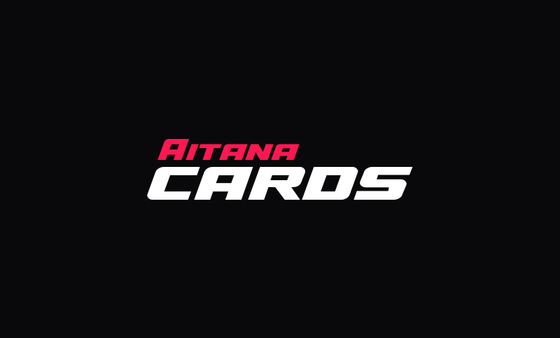

# Aitana cards

Aitana Cards és un projecte sense ànim de lucre dedicat a la recopilació exhaustiva de totes les cartes i cromos col·leccionables que representen la futbolista Aitana Bonmatí. L’objectiu d’aquest projecte és crear un arxiu complet d’aquests articles commemoratius, preservant el llegat i la visibilitat d’aquesta destacada esportista en el món del col·leccionisme.

Aquest projecte no té cap vinculació oficial amb Aitana Bonmatí, ni amb cap empresa, entitat o club esportiu que ostenti els drets sobre les imatges o materials representats en les cartes i cromos recollits. Aitana Cards no busca obtenir cap benefici econòmic i respecta els drets d’autor i marques comercials dels propietaris legals. Tots els materials exposats són únicament amb finalitats informatives i culturals.

[Aitana cards](https://joelthorner.github.io/aitana-cards/)
